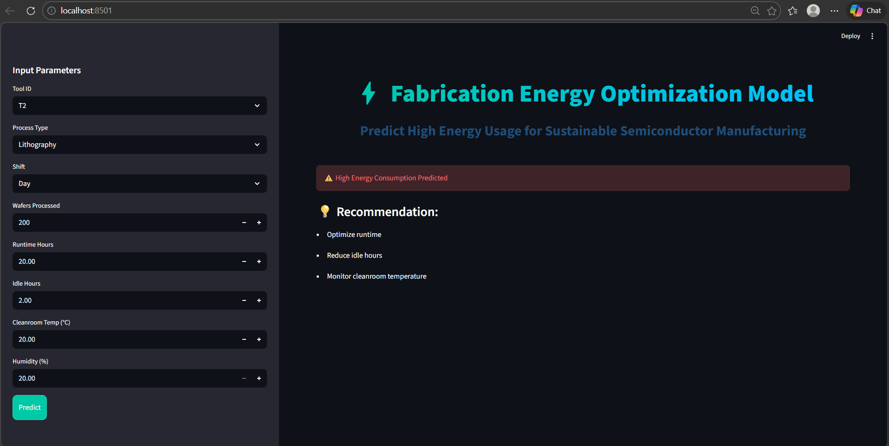

# FAB Energy Consumption Prediction using Machine Learning

## 📌 Project Overview

This project predicts **energy consumption in a semiconductor fabrication (FAB) environment** using Machine Learning.
The goal is to analyze production parameters and estimate energy usage to improve efficiency and reduce operational costs.

## 🧠 Machine Learning Model

The project uses a **trained regression model** to predict energy consumption based on manufacturing process data.

Algorithms used:

* Scikit-learn Regression Model
* Data preprocessing with **StandardScaler**
* Label encoding for categorical variables

## 📂 Project Structure

```
fab-energy-consumption-prediction-ml-model
│
├── app.py                         # Application for prediction
├── FAB_Energy.ipynb               # Jupyter notebook with training code
├── fab_energy_dataset_500-2.csv   # Dataset used for training
├── energy_model.pkl               # Trained ML model
├── scaler.pkl                     # Feature scaling model
├── le_process.pkl                 # Label encoder
├── le_shift.pkl
├── le_tool.pkl
├── requirements.txt               # Python dependencies
└── README.md
```

## ⚙️ Technologies Used

* Python
* Pandas
* NumPy
* Scikit-learn
* Jupyter Notebook

## 🚀 How to Run the Project

### 1️⃣ Install dependencies

```
pip install -r requirements.txt
```

### 2️⃣ Run the application

```
streamlit run app.py
```


## Live Demo
[https://fab-energy-consumption.streamlit.app](https://fab-energy-consumption-prediction-ml-modelbranchmainmainfileap.streamlit.app/)

## 📊 Dataset

The dataset contains manufacturing parameters such as:

* Process Type
* Tool Used
* Shift
* Production parameters
* Energy consumption values

These features are used to train the ML model.

## 🎯 Future Improvements

* Deploy the model using **Streamlit**
* Add real-time energy prediction dashboard
* Improve prediction accuracy using advanced models

## 👩‍💻 Author

**Rutuja Nale**

Machine Learning Project – FAB Energy Consumption Prediction
